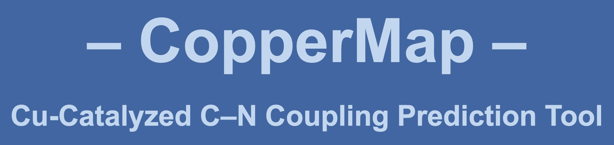

CopperMap is a Jupyter notebook developed to predict outcomes (below or above 20% yield) of Cu-catalyzed C–N couplings (Ullmann couplings) between primary amines and aryl-bromides within the computed library. Additionally, it generates a list of suggested ligands expected to be the best performers for a given pair of coupling partners based on experimental data used to train the model. CopperMap is derived from our manuscript posted on [ChemRxiv](https://chemrxiv.org/engage/chemrxiv/article-details/6532eb5cc3693ca993c1ce40) featuring a library of 497 primary amines, 385 aryl-bromides, and 36 ligands.

## Usage

1. Clone this repository.
```shell
git clone https://github.com/ljkaras/CopperMap.git
```
2. Create and activate the Python environment.
```shell 
conda env create -f environments/coppermap_mac.yml  # for MacBook
```
```shell 
conda env create -f environments/coppermap_windows.yml  # for Windows
```
```shell 
conda activate coppermap
```
3. Install IPykernel and create a Jupyter kernel for the Python environment.
```shell 
conda install ipykernel
```
```shell 
python -m ipykernel install --user --name=coppermap --display-name "coppermap"
```
4. Open the notebook: `CopperMap.ipynb`.
5. Follow the instructions within the notebook for predictions and ligand suggestions.

## Citation

If you find CopperMap useful, please cite our manuscript:

> M. Samha, L. Karas, D. Vogt, E. Odogwu, J. Elward, J. Crawford, J. Steves, M. Sigman. Predicting Success in Cu-Catalyzed C–N Coupling Reactions using Data Science. ChemRxiv, 2023. DOI: 10.26434/chemrxiv-2023-f50w6.

## Credits

Developed by [The Sigman Lab](https://www.sigmanlab.com)  
Developer: Lucas Karas
